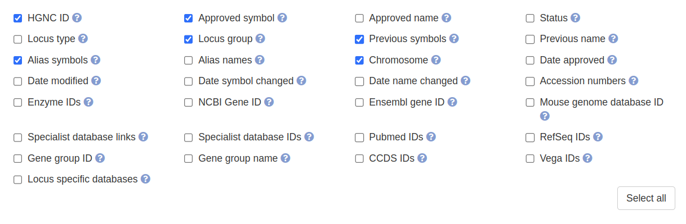
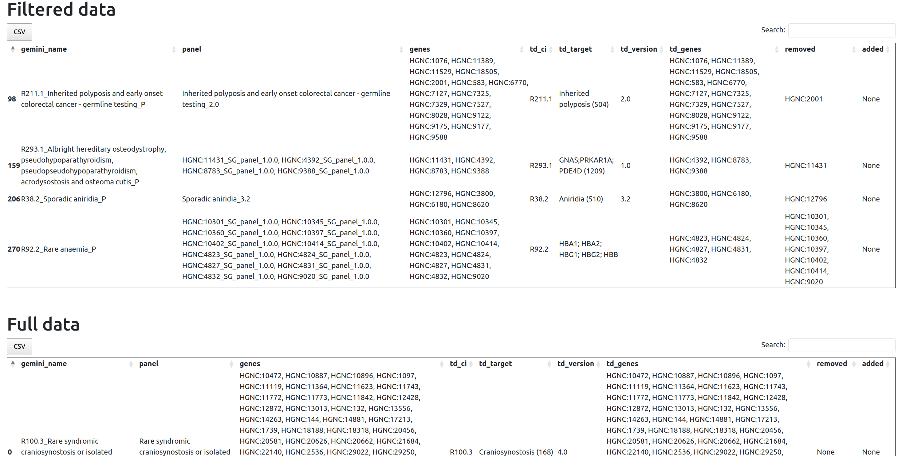
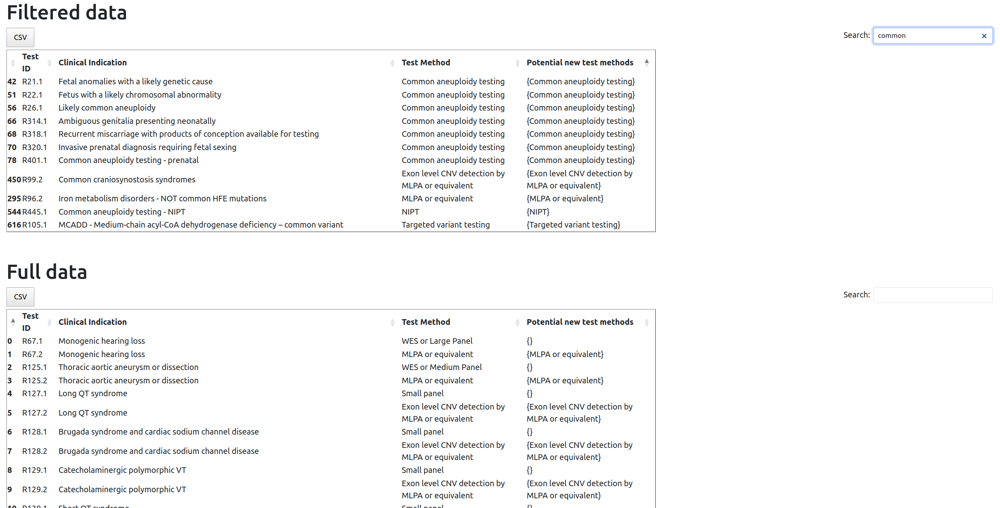
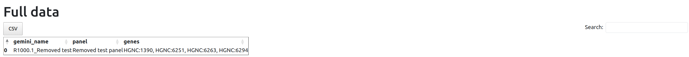
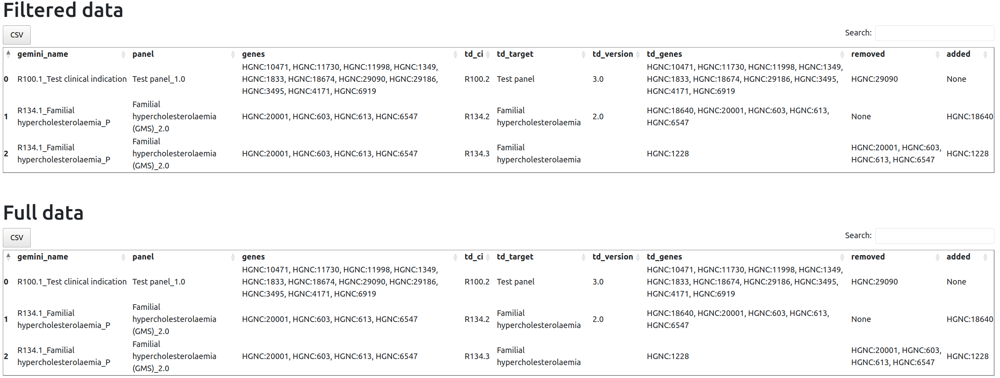
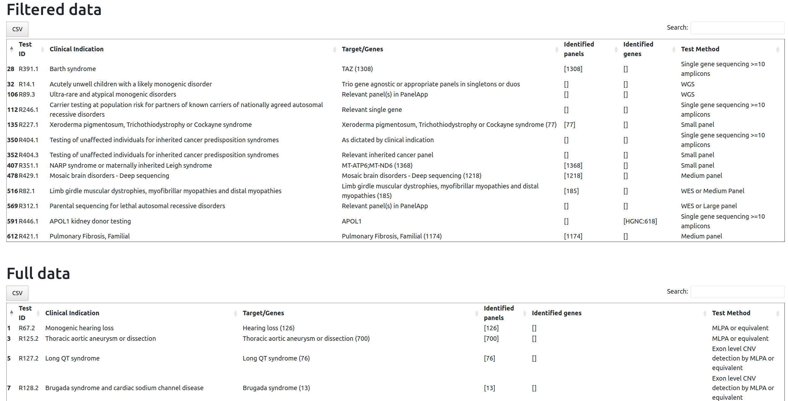

# test_directory_checker

Suite of tests to check the content of the test directory.

## How to setup

### Setup the environment

```bash
python -m venv test_directory_checker
source test_directory_checker/bin/activate
pip install -r requirements.txt 
```

### Download the genepanels file

Find the genepanels that you want to use in DNAnexus in the `001_Reference` project in the `dynamic_files/gene_panels` folder.

### Download the test directory

Either get it from the bioinformatics team or download it from https://www.england.nhs.uk/publication/national-genomic-test-directories/
The version from the website might not be the latest one.

### Download the HGNC dump

From https://www.genenames.org/download/custom/, check the boxes as shown in the screenshot below.



### Find the test directory config

The config file needed for the test directory checker is located here: https://github.com/eastgenomics/test_directory_parser/tree/main/configs

## How to run

```bash
source test_directory_checker/bin/activate
python3 main.py ${excel_td} ${hgnc_dump} ${genepanels_file} -c ${td_config}
```

## Tests

### Check the targets

Using the test directory, the code gets the targets and attempts to identify either genes or panels from the targets.

It outputs an HTML representation of the dataframe containing the identified genes/panels.

The filtered table is filtered to remove clinical indications for which targets were found

Output: `targets.html`



### Check the test methods

Using the test directory, the code compares the test methods in the test directory and the ones in our config file that mimics the ones in the test directory parser. It creates a column where it will output whether the test method is absent from the list from the config file.

It outputs an HTML representation of the dataframe containing the potential new test methods.

The filtered table is filtered using the test methods that we already handle.

Output: `test_methods.html`



### Compare genepanels and test directory

Using the test directory and a genepanels file, the code compares the content of each clinical indication in the genepanels file and finds the corresponding test code or clinical indication code to find if the genepanels clinical indication contains the genepanels ci.

The filtered tables are filtered to remove cases where both the `added` and `removed` columns are None.

Output: `identical_tests.html` + `removed_tests.html` + `replaced_tests.html`






### Find new clinical indications

The code will go through every test in the test directory and it will attempt to find tests missing from the genepanels file.

The filtered table is filtered using the test methods that we have in our test directory parser config file.

Output: `new_cis.html`



## Unittesting

The unit tests check the functions of the `checker.py` file. These are the main functions used to check the content of the test directory.

```bash
py.test -s tests/test_checker.py --td tests/test_files/test_td.tsv --genepanels tests/test_files/test_genepanels.tsv --hgnc_dump ${hgnc_dump} --config tests/test_files/test_config.json
```
